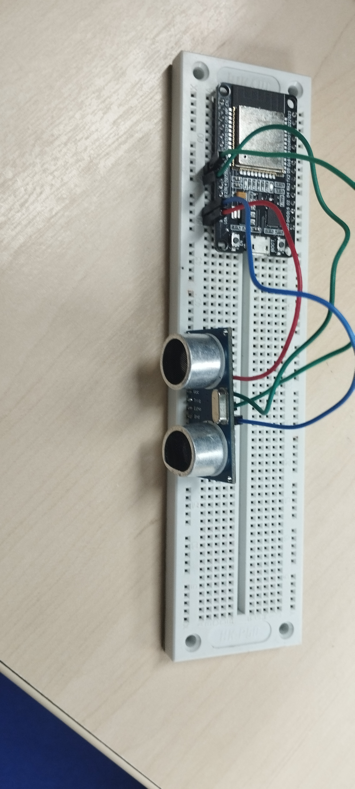

# Contador de Pessoas Usando ESP32 e Sensores Ultrassônicos (HC-SR04)

Este projeto utiliza um ESP32 e dois sensores ultrassônicos HC-SR04 para contar quantas pessoas estão dentro de uma sala. O primeiro sensor detecta quando uma pessoa entra, enquanto o segundo sensor identifica quando alguém sai. O código mede a distância entre os sensores e a pessoa, determinando se ela entrou ou saiu da sala com base nos limites de distância definidos.

## Componentes Necessários

- 1 x ESP32
- 2 x Sensores ultrassônicos HC-SR04
- Fios de conexão
- Protoboard (opcional)

## Esquema de Ligação

O diagrama de ligação do projeto pode ser visualizado na imagem abaixo:


### Conexões:

- **HC-SR04 (Sensor 1)**:
  - VCC → 3.3V do ESP32
  - GND → GND do ESP32
  - TRIG → Pino 14 do ESP32
  - ECHO → Pino 27 do ESP32
- **HC-SR04 (Sensor 2)**:
  - VCC → 3.3V do ESP32
  - GND → GND do ESP32
  - TRIG → Pino 17 do ESP32
  - ECHO → Pino 16 do ESP32

## Funcionamento do Projeto

Este projeto mede a distância dos objetos à frente de cada sensor ultrassônico. A lógica principal é a seguinte:

- **Sensor 1**: Se a distância detectada for menor ou igual a 60 cm, considera-se que uma pessoa entrou na sala.
- **Sensor 2**: Se a distância detectada estiver entre 60 cm e 120 cm, considera-se que uma pessoa saiu da sala.

O número de pessoas dentro da sala é atualizado com base nas leituras de ambos os sensores.

## Código

O código a seguir foi desenvolvido para o ESP32. Ele configura os sensores, mede as distâncias e realiza a contagem das pessoas que entram e saem da sala.

```cpp
#include <Arduino.h>

#include <WiFi.h>
#include <WiFiMulti.h>

#include <HTTPClient.h>

#define SOUND_SPEED 0.034
#define MIN_DISTANCE_IN_CM 60.0

const int trig = 27;
const int echo = 26;

HTTPClient http;
WiFiMulti wifiMulti;

void checkWifiConnection(){
  for (uint8_t t = 4; t > 0; t--) {
    Serial.printf("[WIFI_SETUP] aguarde %d...\n", t);
    Serial.flush();
    delay(1000);
  }

  wifiMulti.addAP("WIFI-IFBA", "");
}

void setup() {
  Serial.begin(115200);
  pinMode(trig, OUTPUT);
  pinMode(echo, INPUT);
  checkWifiConnection();
}

void loop() {
  clearAll();

  float distance = getDistance(); // cm
  Serial.println("Distancia Sensor 01: " + String(distance) + " cm");
  if (distance > MIN_DISTANCE_IN_CM) return;

  delayMicroseconds(2);

  if ((wifiMulti.run() != WL_CONNECTED)) {
    Serial.println("Wifi não conectado");
    return;
  } 

  http.setReuse(false);
  http.begin("https://esp-32-two.vercel.app/add");

  Serial.print("[HTTP] --> Registrando uma pessoa na sala");

  int statusCode = http.GET();
  handleResponse(statusCode);

  http.end();

  delay(5000);
}

void handleResponse(int statusCode){
  if(statusCode <= 0) {
    Serial.printf("[HTTP] --> Request falhou: %s\n", http.errorToString(statusCode).c_str());

    return;
  }

  Serial.printf("[HTTP] --> Request finalizada: %d\n", statusCode);
  Serial.printf("Mensagem: %s", http.getString());
}


int getDistance() {
  emitPulse();
  long duration = pulseIn(echo, HIGH);
  return (duration * SOUND_SPEED) / 2;
}

void emitPulse() {
  digitalWrite(trig, HIGH);
  delayMicroseconds(10);
  digitalWrite(trig, LOW);
}

void clearAll() {
  digitalWrite(trig, LOW);
  delayMicroseconds(2);
}
```

## Explicação do Código

1.  **Definição dos Pinos**:

    - `trigPin01` e `echoPin01` para o Sensor 1 (entrada).

2.  **Velocidade do Som**:

    - A velocidade do som é definida como 0,034 cm/μs, usada para calcular a distância com base no tempo de ida e volta do pulso ultrassônico.

3.  **Configuração Inicial**:

    - Configura os pinos TRIG como saída e os pinos ECHO como entrada para ambos os sensores.

4.  **Medição de Distância**:

    - Função `getDistance()`: emite um pulso ultrassônico e calcula a distância com base no tempo de resposta.

5.  **Contagem de Pessoas**:

    - Se o sensor 1 detectar uma distância menor que 60 cm, o código considera que alguém entrou na sala e incrementa o contador.

6.  **Contagem na Api**:

    - Fazemos uma requesição para esse endpoint https://esp-32-two.vercel.app/add para contar a quantidade de pessoas





## Instalação

1.  Instale a IDE Arduino (caso ainda não tenha) e adicione o suporte para o ESP32.
2.  Conecte o ESP32 ao seu computador.
3.  Faça upload do código para o ESP32.

## Como Usar

1.  Coloque os dois sensores em posições estratégicas para monitorar a entrada e saída de pessoas em uma sala.
2.  Acompanhe o número de pessoas dentro da sala através do monitor serial da IDE Arduino.

## Contribuições

Se você deseja contribuir com melhorias neste projeto, sinta-se à vontade para enviar um _pull request_ ou relatar problemas na seção de _Issues_.
