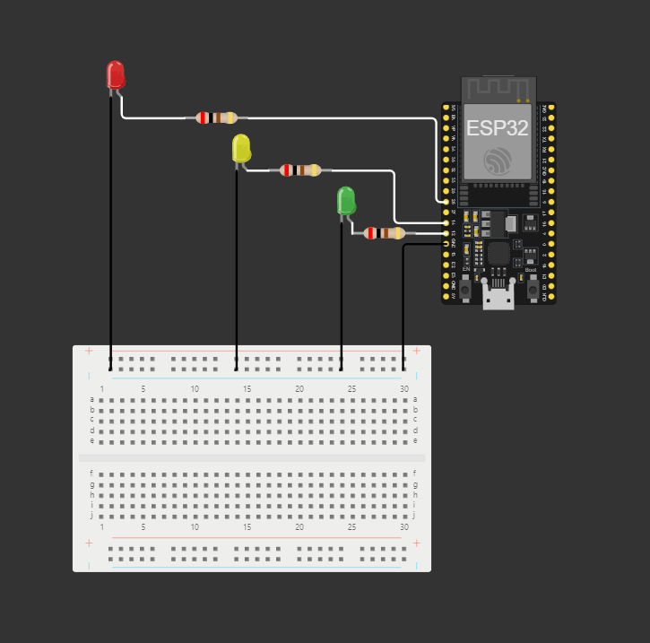

# ESP32 Traffic Light Example

Este projeto demonstra como usar um ESP32 para criar um simples sinal de trânsito utilizando LEDs. O circuito foi montado em uma protoboard com três LEDs (verde, amarelo e vermelho) que simulam as cores de um sinal de trânsito.

## Circuito

A imagem abaixo mostra o esquema de montagem do circuito:



### Componentes

- 1 x ESP32
- 1 x LED verde
- 1 x LED amarelo
- 1 x LED vermelho
- 3 x resistores (220Ω)
- Jumpers
- Protoboard

### Conexões

- LED verde: Pino 12 do ESP32
- LED amarelo: Pino 14 do ESP32
- LED vermelho: Pino 26 do ESP32

## Funcionamento

O código controla os três LEDs para simular o comportamento de um sinal de trânsito:

- **Verde**: Acende por 20 segundos.
- **Amarelo**: Acende por 3 segundos.
- **Vermelho**: Acende por 40 segundos.

Após o LED vermelho apagar, o ciclo recomeça, e o LED verde acende novamente.

### Código

```cpp
const int GREEN_LED = 12;
const int YELLOW_LED = 14;
const int RED_LED = 26;

// GREEN: 20 s = 20.000 ms
// YELLOW: 3 s = 3.000 ms
// RED: 40 s = 40.000 ms

void setup() {
  Serial.begin(115200);
  pinMode(GREEN_LED, OUTPUT);
  pinMode(YELLOW_LED, OUTPUT);
  pinMode(RED_LED, OUTPUT);
}

void loop() {
  awaitAndProgress(GREEN_LED, 20000);
  awaitAndProgress(YELLOW_LED, 3000);
  awaitAndProgress(RED_LED, 40000);
}

void awaitAndProgress(int sign, int time){
  digitalWrite(sign, HIGH);
  delay(time);
  digitalWrite(sign, LOW);
}
```